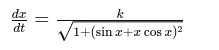

1) For a height of 1km, 
Time taken for echo = 1000 / 343 * 2
Which is more than 4 seconds
So horizontal displacement in this time is too big to ignore

Assumptions:
1) The radius of view of the ultrasound sensor is short, so we don't get interference from the sides of the buildings
2) The simulator need not consider the horizontal displacement, as data is random data anyway

graph the data that you see

Intentionally ignoring the specifics of setups and reads for electronics sensors. We can rather learn it while working with actual electronics

Parameterisation for h = x/d sin x/c:

solve ordinary differential equations (ODEs) is the Runge-Kutta method (specifically, the 4th-order Runge-Kutta method is widely used due to its accuracy and stability). Another simpler method is Euler's method, but it is less accurate.

Right way to calcualte number of vlaues in array for the given x distance, would be after transforming x to t

Data generated at 1m/s

Important: Constant data should be used be used at the end of the simulation, and announce the coordinates
Maybe make the drone land at the end?